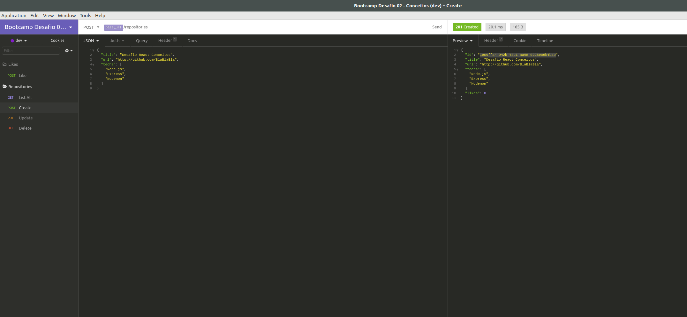

<h1>Bootcamp Desafio 02 - Conceitos</h1>
Nesse desafio, fora criada uma aplicação básica para treinar o que foi aprendido até agora no Node.js!

Dada aplicação tem como objetivo, armazenar repositórios de um pseudo portfólio, que irá permitir a criação, listagem, atualização e remoção dos repositórios, como também, permitir que estes recebam "likes".

Abaixo se encontra uma imagem do template utilizado inicialmente, disponível na seguinte url: **[Acessar Template](https://github.com/Rocketseat/gostack-template-conceitos-nodejs)**
 
<p align="center">
  
</p>

## Rodando a aplicação

Para se rodar a aplicação, após a clonagem da mesma, é necessário primeiro baixar o `node_modules` e dependências necessárias. Para isso, no terminal:

```
yarn
yarn dev
```
Com o primeiro comando, teremos as dependências necessárias para a aplicação rodar, baixadas. Já com o uso de `yarn dev`, o servidor será levantado e pronto para receber e responder as requisições.

## Rotas da aplicação
Com o temaplate clonado, é necessário abrir o arquivo `app.js` e preencher as rotas de acordo com os objetivos propostos.

- **`POST /repositories`**: A rota deve receber `title`, `url` e `techs` dentro do corpo da requisição, sendo a URL o link para o github desse repositório. Ao cadastrar um novo projeto, ele deve ser armazenado dentro de um objeto no seguinte formato: `{ id: "uuid", title: 'Desafio Node.js', url: 'http://github.com/...', techs: ["Node.js", "..."], likes: 0 }`; Certifique-se que o ID seja um UUID, e de sempre iniciar os likes como 0.

- **`GET /repositories`**: Rota que lista todos os repositórios;

- **`PUT /repositories/:id`**: A rota deve alterar apenas o `title`, a `url` e as `techs` do repositório que possua o `id` igual ao `id` presente nos parâmetros da rota;

- **`DELETE /repositories/:id`**: A rota deve deletar o repositório com o `id` presente nos parâmetros da rota;

- **`POST /repositories/:id/like`**: A rota deve aumentar o número de likes do repositório específico escolhido através do `id` presente nos parâmetros da rota, a cada chamada dessa rota, o número de likes deve ser aumentado em 1;

## Trabalhando as rotas no Imsomnia

Para testar adequadamente o uso das rotas, aqui usamos o <strong>Insomnia</strong>. Assim como se vê logo abaixo:

<p align="center">
  
</p>

No exemplo acima apresentado,  temos:

-  lateral esquerda: organização das rotas;
-  centro: se encontra o envio de um json contendo informações para o cadastro de um novo <strong>repositories</strong>;
- topo: o caminho para a rota própriamente dita;
- lateral direita: resultado da requisição (response).

## O Código

Em Breve!

## Para Mais Detalhes

Para mais detalhes a respeio do desafio, checar página oficial do mesmo em **[Desafio](https://github.com/Rocketseat/bootcamp-gostack-desafios/blob/master/desafio-conceitos-nodejs/README.md)**.